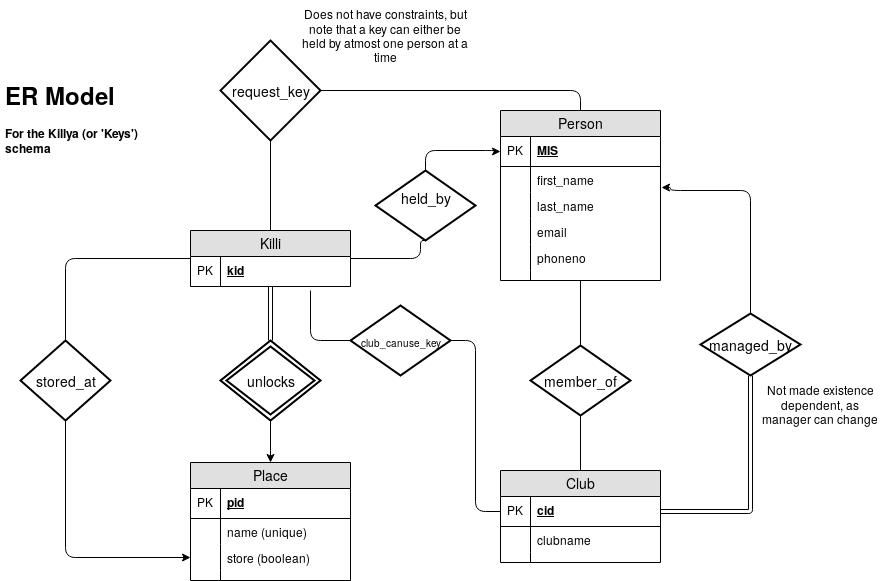
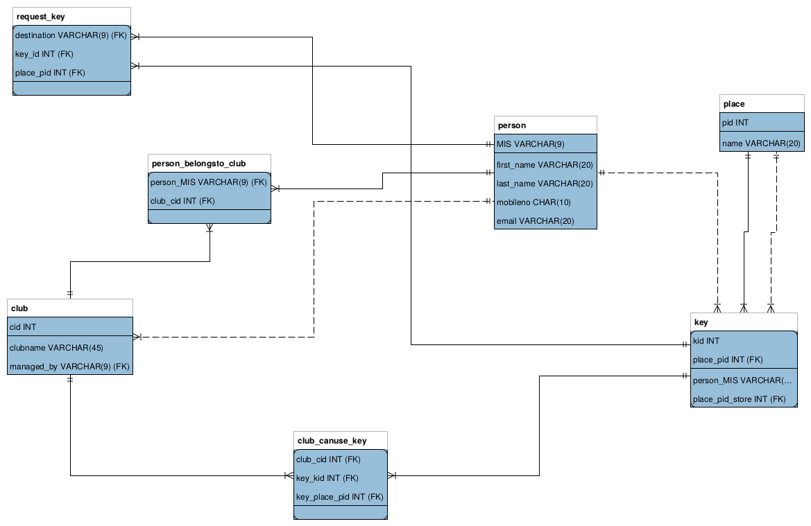

# KilliKuthe
## A web application for tracking keys of college labs

## Problem Statement
* Colleges like COEP have a number of clubs each who work in particular labs- for example, the COEP satellite team works in the FABLAB of production department, and Groundstation in Metallurgy Terrace.
* As a result, they need access to keys to these labs, along with the key to Metallurgy Department Backdoor
* Some of these keys are also accessible to M Tech research groups or Cultaral Team may have access to the Meta Backdoor key.
* A **real** problem faced is this- when I want to unlock a lab, I can't find the key in it's designated place- some other person might have taken it, or may have kept it at some other place. Now I don't know whom to call, so I spam whatsapp groups, call random people who are likely to have the key.

## Introduction
* A web app with a database at the back end can be used to solve this problem
* The database can be used to track who has which key, and the web app can be used to modify the database when people pick up keys, hand them over to someone else, etc
* A system is already in place where club members need to make entries with the security section when he takes the key from it's designated place.
* The database will track-
 1. Which students are members of which clubs
 2. Which clubs have permissions to access which keys
 3. Who has which key / at which place is the key kept- along with contact numbers and email IDs of people, for easy communication
* Besides these core features, other expansions can be made- like integration with the MIS database of the college, or mantaining logs of key pick up / put in place / handover transactions

* Another point to be noted is that keys, doors, people, clubs, club managers, key requests provide an excellent exercise in database design, as they involve a large amount of relations, foreign key constraints, and even a real example of a weak entitiy set!

### Technologies
* This app uses MySQL, it's MySQL/Python connector (described at [https://dev.mysql.com/doc/connector-python/en/](MySQL Python Connector official documentation)) as the *Model* or the Database at the back end.
* Flask- a micro-web framework for Python is used as the *Controller*. Flask is not suitable for large scale applications, but is perfect for an application that will only run for 1000 people (number of college students) [https://flask.palletsprojects.com/en/1.1.x/](Flask)
* Bootstrap, an easy to use CSS + Javascript template library used for front end, so as to minimize the effort spent on developing it. [Bootstrap](https://getbootstrap.com/)
* Additionaly, MySQL Workbench was used as aid for designing the Database in SQL.

## Functional Requirements:

### Functionalities in which database is modified

1. Registering a user (so that he can become a member of a club)
2. Adding a place (a place may have multiple keys)
3. Registering a club, with a manager / secretary
4. Changing the manager of a club
5. Adding members to a club (to be done by the club secretary)
6. Adding a key for a place (this is a real key, which is a weak entity existent dependent on the place)
7. Grant permission to a club to use a key
8. Take away permission of a club to use a key
9. Pick up a key- change it's location from a place to a person
10. Place a key- change it's location from a person to a storage place

> Moving a key from one person to another should be a handshake. Else a person giving could falsely claim to have given it, and the person taking it will falsely claim to have taken it. The mechanism here is that a person requests the holder to transfer the key to them. The holder confirms the transfer when the physical transfer happens.

11. Request a key from a person
12. Transfer a key to a person requesting it
13. Remove a person from a club

> A place can be a *key store*- such a place would allow keys of places other than it's own to be placed there. (eg. security section, FABLAB)

14. Change the storage status of a place.

Besides this, there are a number of views required (not in the CREATE VIEW sense, but in the sense that users need to be able to see data)

### Functionalities which require queries on the database

1. See all people
2. See all clubs
3. See all places
4. See the keys of a particular place

> A place can have many keys.

> For people

5. See all keys which one is allowed to use (according to club membership) which are placed at some storage place
6. See list of all keys one has requested from someone
7. Cancel a request (TODO)
8. Get a list of keys one is allowed to use held by someone else, but one has not made a request for it
9. Get a list of keys one holds
10. Get a list of requests of keys to you
11. Get a list of valid places to keep the key
12. See a list of clubs one is a manager of
13. Get a list of clubs one is a member of
14. Get a list of people who are not a part of a club (so as to add them) TODO
15. Get a list of keys for a place, and lists of those clubs which can and cannot access them (for adding / removing permissions)
16. Check whether a person is allowed to use a key

## Entity-Relationship Diagram

> "Few entities *LOTS* of relations.

## Relational Schema Diagram

> Lots of relations are one-one, so only foreign key suffices

